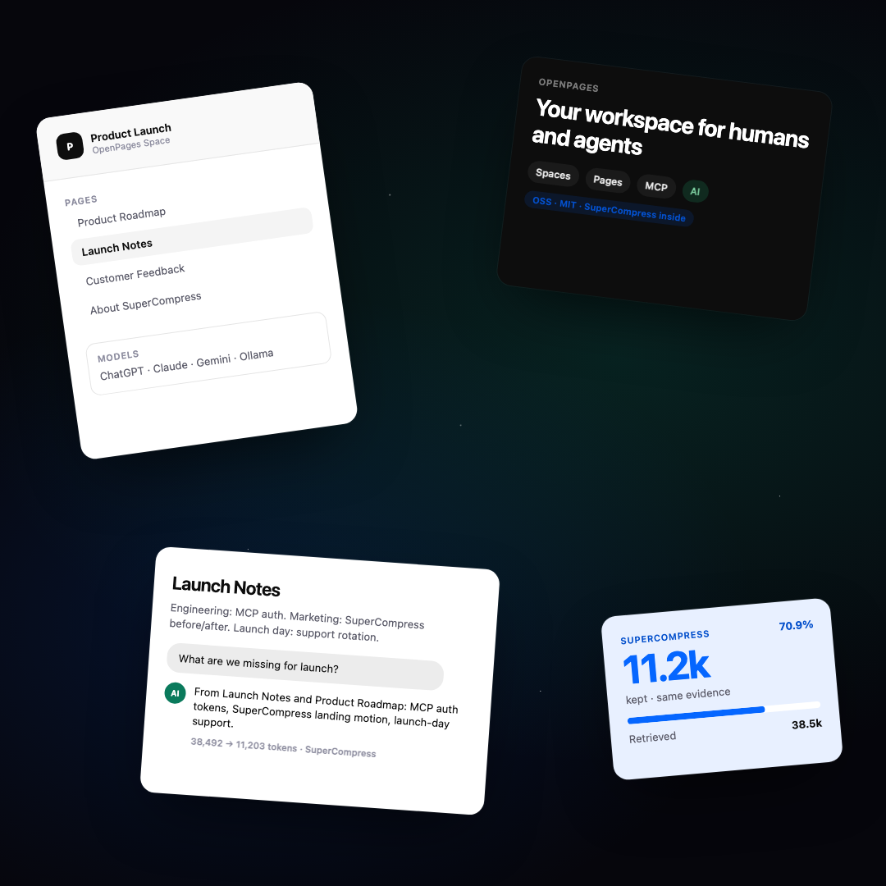
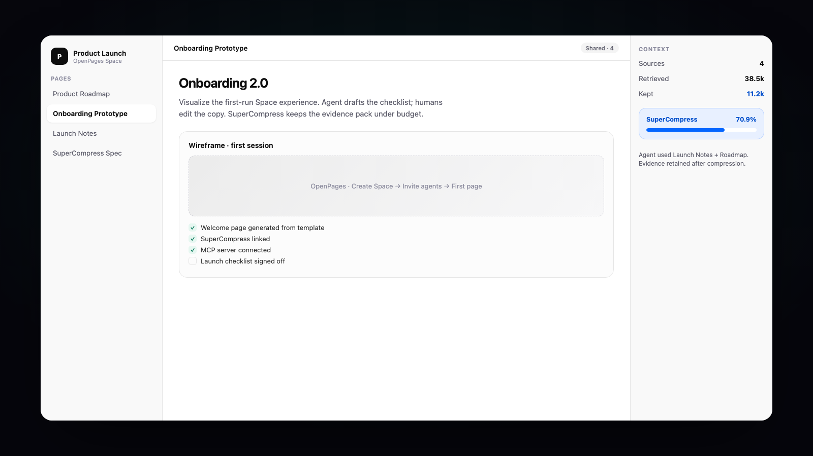
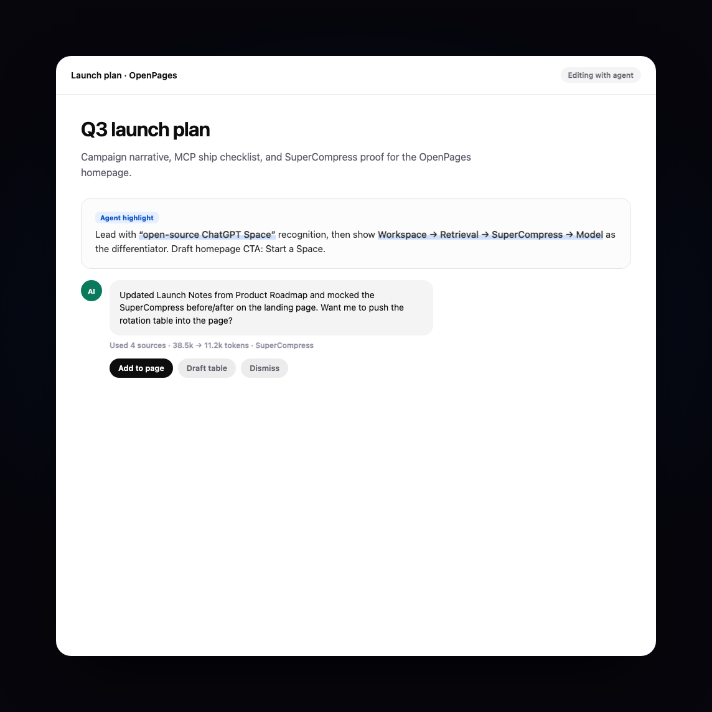
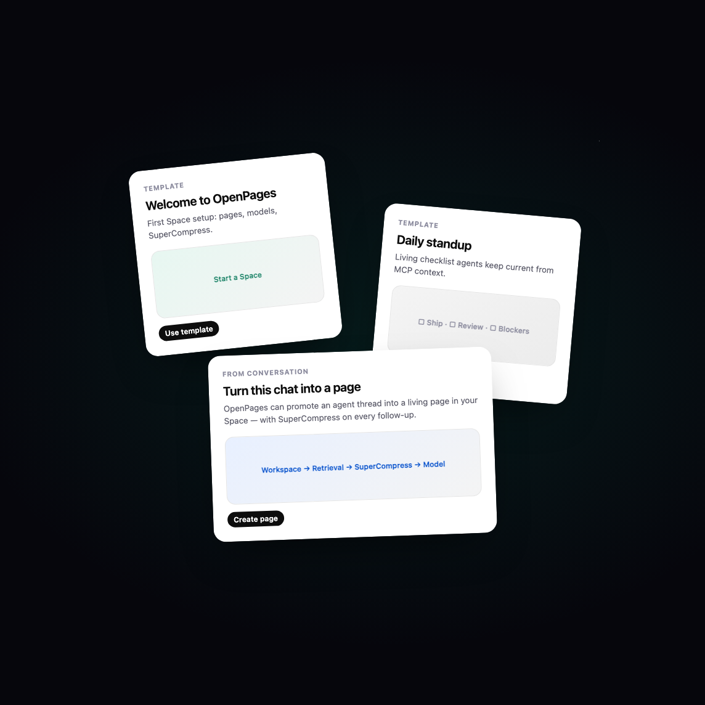

<p align="center">
  <strong>OpenPages</strong><br />
  <em>Make room for your next idea.</em>
</p>

<p align="center">
  <a href="https://openpages-app.vercel.app"><strong>Live demo</strong></a> ·
  <a href="https://github.com/arjunkshah12345-hash/openpages">GitHub</a> ·
  <a href="https://www.supercompress.dev">SuperCompress</a>
</p>

<p align="center">
  Open-source AI workspace with persistent Spaces, collaborative pages,<br />
  and <a href="https://www.supercompress.dev"><strong>SuperCompress</strong></a> as the core context layer.<br />
  <em>Open-source alternative to OpenAI Pages / ChatGPT Space.</em>
</p>

<p align="center">
  <a href="#local-development">Quick start</a> ·
  <a href="#why-supercompress">Why SuperCompress</a> ·
  <a href="ARCHITECTURE.md">Architecture</a> ·
  <a href="#mcp">MCP</a> ·
  <a href="#docker">Docker</a>
</p>

<p align="center">
  
</p>

<p align="center">
  
</p>

<p align="center">
  
  &nbsp;&nbsp;
  
</p>

---

## The pitch

Most AI workspaces dump the whole room into the model.

**OpenPages does not.**

```
Workspace → Retrieval → SuperCompress → Model
```

Your Space can grow forever. Your context window — and your bill — do not grow with it.

> **Persistent context without persistent token costs.**

OpenPages is a real product (Spaces, Pages, agents, MCP) and a living demo of [SuperCompress](https://www.supercompress.dev): query-aware context compression that keeps answer-critical evidence and drops the rest.

---

## Why SuperCompress

| Without SuperCompress | With SuperCompress |
|---|---|
| Stuff Notion / Drive dumps into Claude | Retrieve candidates, compress against the *query* |
| Token bill scales with workspace size | Token bill scales with *relevant* evidence |
| Truncate or summarize → lose IDs / errors | Keep original wording for what matters |
| “Hope the model finds it” | Context inspector shows sources + savings |

Every chat turn, agent run, and MCP `workspace_context` call:

1. **Retrieve** relevant pages, files, and conversation snippets  
2. **Compress** that candidate context with SuperCompress (hosted API or local offline stand-in)  
3. **Infer** with your chosen model — OpenAI, Anthropic, Gemini, OpenRouter, or Ollama  
4. **Show** original vs compressed tokens in the Context inspector  

SuperCompress is not a plugin toggle. It is the economic layer that makes large agent workspaces viable.

Get a key: [supercompress.dev/dashboard](https://www.supercompress.dev/dashboard) · Docs: [docs.supercompress.dev](https://docs.supercompress.dev)

---

## Features

- **Spaces** — multi-space workspaces (pages, files, search, settings, agent activity)
- **Pages** — Tiptap block editor, `/` commands, autosave, checklists, tables, mermaid
- **Inline AI** — rewrite / improve / shorten / expand with accept / reject proposals
- **Workspace agent** — cited answers over the Space
- **Agent mode** — multi-step goals, activity timeline, page creation
- **Context inspector** — sources, retrieved tokens, SuperCompress savings, expandable context
- **Model agnostic** — ChatGPT account (no API key), OpenAI, Anthropic, Gemini, OpenRouter, Groq, Mistral, DeepSeek, Together, Fireworks, xAI, Azure, Ollama, or custom OpenAI-compatible — always behind SuperCompress
- **MCP** — Cursor / Claude Code / Codex can search, read, write, and pull compressed context
- **Version history** — user / agent / mcp attribution + restore
- **Self-host** — SQLite by default, Docker Compose included

---

## Local development

```bash
git clone https://github.com/arjunkshah12345-hash/openpages.git
cd openpages
cp .env.example .env   # optional — onboarding can store credentials instead
npm install
npm run dev
```

Open [http://localhost:3000](http://localhost:3000) → **Start a Space** runs the local onboarding wizard:

1. **SuperCompress** — paste your key from [supercompress.dev/dashboard](https://www.supercompress.dev/dashboard) (required for the real compiler; offline stand-in is buried behind an intentional confirm)
2. **Bring your own inference** — pick how you run models:
   - **ChatGPT account** — Login with ChatGPT (device code) or import `~/.codex/auth.json`. No `sk-` API key for Plus/Pro
   - **OpenAI API** — paste a platform `sk-…` key and choose GPT-5.4 / o-series models
   - **Other providers** — Anthropic, Gemini, OpenRouter, Groq, Ollama, and more
3. Credentials are saved to `~/.openpages/settings.json` (mode `0600`)

A **Product Launch** demo Space is seeded so first-run chat already shows compression in the inspector.

### Environment (optional)

You can still use `.env` instead of (or in addition to) the wizard. Settings file wins when both are set.

| Variable | Purpose |
|----------|---------|
| `SUPERCOMPRESS_API_KEY` | Hosted SuperCompress ([dashboard](https://www.supercompress.dev/dashboard)) |
| `SUPERCOMPRESS_API_URL` | Override compress endpoint (default `https://api.supercompress.dev/compress`) |
| `OPENAI_API_KEY` / `ANTHROPIC_API_KEY` / `GOOGLE_API_KEY` / `OPENROUTER_API_KEY` / `GROQ_API_KEY` / … | Model providers |
| `OLLAMA_BASE_URL` | Local models (default `http://127.0.0.1:11434/v1`) |
| `OPENPAGES_SETTINGS_PATH` | Override settings file location |
| `CODEX_AUTH_PATH` | Override Codex auth import path |

Without a SuperCompress key, OpenPages uses a local query-aware fallback so the pipeline and inspector still work. Without a model connection, answers are demo replies — **retrieval + SuperCompress still run**.

---

## Docker

```bash
cp .env.example .env
# set SUPERCOMPRESS_API_KEY + at least one model key
docker compose up --build
```

Data persists in the `openpages-data` volume (`/data/openpages.db`).

---

## MCP

Expose a Space to Cursor, Claude Code, Codex, and other MCP clients:

```json
{
  "mcpServers": {
    "openpages": {
      "command": "node",
      "args": ["/absolute/path/to/openpages/mcp/server.mjs"],
      "env": {
        "OPENPAGES_URL": "http://127.0.0.1:3000",
        "OPENPAGES_SPACE_ID": "space_demo"
      }
    }
  }
}
```

Tools: `space_search`, `page_list`, `page_get`, `page_create`, `page_update`, `file_get`, **`workspace_context`** (retrieve + SuperCompress).

HTTP bridge: `POST /api/mcp` with `{ "tool": "workspace_context", "arguments": { "spaceId": "...", "query": "..." } }`.

---

## Architecture

See [ARCHITECTURE.md](./ARCHITECTURE.md) for the full map.

```
src/lib/retrieval/      → find candidates in the Space
src/lib/supercompress/  → compress against the query (API + local)
src/lib/models/         → provider-agnostic inference
src/lib/ai/             → shared generate / demo helpers
```

---

## Stack

Next.js · TypeScript · Tailwind · Tiptap · Drizzle · SQLite · Vercel AI SDK · **SuperCompress**

---

## License

MIT — build on it, self-host it, star it if SuperCompress made your agent workspace affordable.
